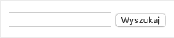
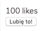

# Komponenty - podstawy

## Przygotowanie
> Zmodyfikuj plik `webpack.config.js` tak aby:
> - zmienna `entryPath` wskazywała na `1_Zadania/Dzien_3/6_Komponenty_podstawy`
> - zmienna `entryFile` wskazywała na plik, nad którym aktualnie pracujesz, np. `task01.js`
>
> **Pamiętaj aby po każdej zmianie w pliku `webpack.config.js` przerwać działanie Webpacka (`CTRL+C`) a następnie włączyć go z powrotem (`npm start`).**

## Zadanie rozwiązywane z wykładowcą

### Zadanie 0a - `js/task0a.js`

Stwórz komponent wyszukiwarki. Powinien on posiadać jedno pole tekstowe `input` i obok `button` "Wyszukaj".

Póki co, komponent ten ma nic więcej nie robić. Wyrenderuj go na stronie.

Zadanie wykonaj w dwóch wersjach:

- Najpierw z komponentem w wersji funkcyjnej
- Oraz z tym samym komponentem w wersji zbudowanej z klasy ES6

Przykładowy wynik:

## Zadania do samodzielnego wykonania

### Zadanie 1 - `js/task01.js`

Stwórz komponent o nazwie `LikeBox`.

Powinien on składać się z licznika polubień oraz przycisku do kliknięcia, że użytkownikowi podoba się dana treść.

Póki co, komponent ten ma nic więcej nie robić. Wyrenderuj go na stronie. Zadanie wykonaj w oparciu o **komponent funkcyjny**.

Przykładowy wynik:

---

### Zadanie 2 - `js/task02.js`

Stwórz komponent `Menu`. Powinien on składać się z pojedynczego elementu listy `ul`, a w niej powinny się pojawić elementy `li`, w których będą odpowiednie odnośniki `a`.

Lista: nazwa - odnośnik

- Strona główna - /
- Blog - /blog
- Cennik - /cennik
- Kontakt - /kontakt

Wyrenderuj komponent na stronie. Zadanie wykonaj w oparciu o **komponent klasowy**.
