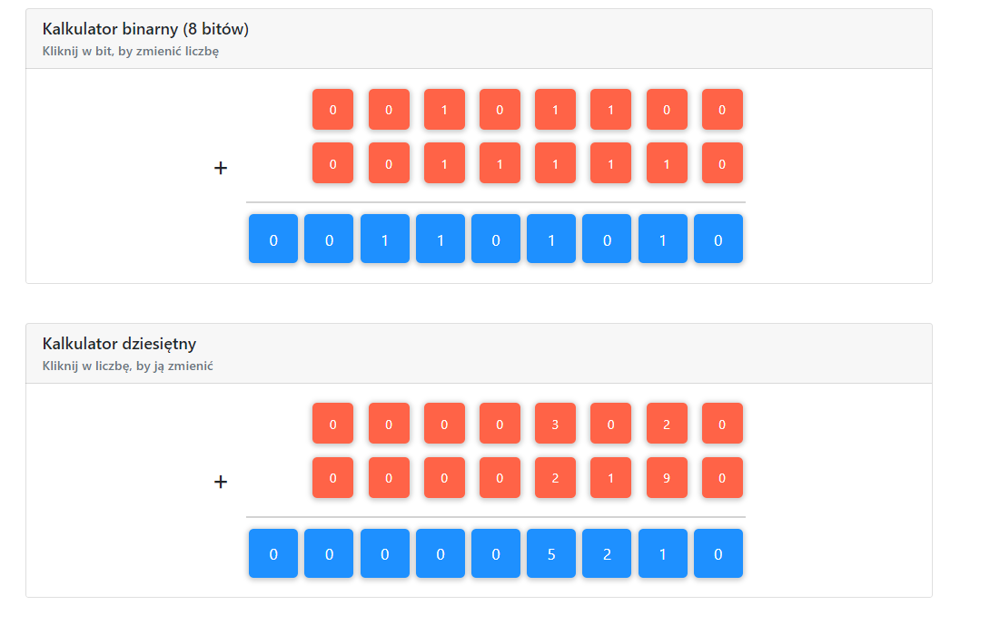

# Calculators

## Table of contents
* [General info](#general-info)
* [Screenshots](#screenshots)
* [Technologies](#technologies)
* [Setup](#setup)
* [Features](#features)
* [Status](#status)
* [Inspiration](#inspiration)
* [Contact](#contact)

## General info
It's a simple application for adding decimal numbers. In this Project Binary
Calculator was added by other Developer. I made Decimal Calculator. 
 Both calculators work the same. We can add to numbers. After overflow the field in result row
 (more than 9) we move 1 left and leave rest in filed). E.x 9+3 = 12. 
 We move 1 next to the field and leave 2 in result field.

## Screenshots
###Calculators View

## Technologies
* HTML - version 5.0
* CSS - version 4.0
* Vanilla JavaScript ECMAScript 6

## Setup
How to start:

To start development follow this instruction:

* `clone` this repo
* `npm install` all necessary npm packages
* `npm start` project

## Features
List of features ready and TODOs for future development
* Added Decimal Calculator

## Status
Project is: _done_, 

## Inspiration
Project inspired based on CodersLab guidelines. 

## Contact
Created by Mateusz Kusmierczyk. Feel free to contact me!

